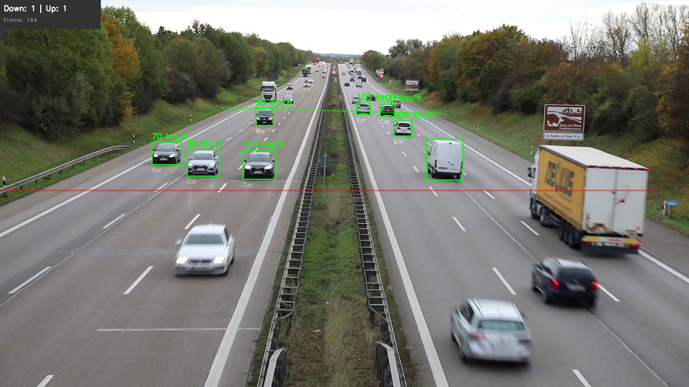

# Vehicle Speed Detection using YOLO and Optical Flow

Advanced computer vision system for detecting and measuring vehicle speeds on highways using YOLO object detection and optical flow algorithms.



## Overview

This system processes highway video footage to:
- **Detect and track vehicles** in real-time
- **Calculate accurate speeds** using perspective-corrected measurements
- **Count vehicles** by direction (up/down)
- **Generate comprehensive logs** with vehicle metadata
- **Export annotated videos** with speed overlays


## Features

### YOLO-Based Detection (`yolo.py`)
The primary implementation using state-of-the-art deep learning:

- **YOLO26 Medium Segmentation Model** - Fast and accurate vehicle detection
- **Kalman Filtering** - Smooth trajectory tracking and velocity estimation
- **Mahalanobis Outlier Rejection** - Filters unreliable detections for stable speeds
- **EMA Smoothing** - Exponential moving average for consistent speed display
- **Perspective Transform** - Bird's-eye view conversion for accurate distance measurement
- **ByteTrack Integration** - Robust multi-object tracking across frames
- **Real-time Processing** - GPU-accelerated inference with FP16 support
- **Comprehensive Logging** - CSV export with vehicle ID, type, speed statistics, and trajectory data

### Optical Flow Methods

#### Dense Optical Flow (`gunnar_farneback.py`)
- Gunnar-Farneback algorithm for pixel-level motion analysis
- Background subtraction for vehicle segmentation
- Morphological operations for noise reduction
- Simple perspective correction based on Y-position

#### Sparse Optical Flow (`lukas_kanade.py`)
- Lucas-Kanade algorithm with Shi-Tomasi corner detection
- Feature point tracking across frames
- Motion vector visualization
- Periodic re-detection of tracking points

## System Architecture

### Calibration
- **Detection Area**: 105 meters (verified from highway markers)
- **Resolution**: 1920×1080 processing (preserves aspect ratio)
- **Bird's-Eye Transform**: 41m × 105m calibrated rectangle
- **Reference Lines**: Line 1 at 0m (green), Line 2 at 105m (red) for visualization

### Speed Calculation
1. Vehicle detected by YOLO with bounding box
2. Bottom-center footpoint extracted (ground contact)
3. Transformed to bird's-eye view coordinates
4. Kalman filter tracks position and estimates velocity
5. Speed calculated from velocity magnitude: `speed_kmh = √(vx² + vy²) × 3.6`
6. EMA smoothing applied for stable display
7. Validated against 30-160 km/h range

### Tracking Pipeline
```
Frame Input → YOLO Detection → ByteTrack ID Assignment → Footpoint Extraction
     ↓
Perspective Transform → Kalman Predict → Outlier Check → Kalman Update
     ↓
Speed Calculation → EMA Smoothing → Trajectory Analysis → Display & Logging
```

### Vehicle Counting Logic
```
For each tracked vehicle:
  - Initialize: Record starting position and velocity
  - Update: Track min/max Y-position, compute velocity average
  - Count when:
    • Tracked for 10+ frames (>0.4 seconds)
    • Traveled 35+ meters
    • Average velocity clearly positive (down) or negative (up)
```

## Installation

### Requirements
```bash
pip install opencv-python numpy torch ultralytics
```
### Models
The system uses pre-trained models (auto-downloaded on first run):
- `yolo26m-seg.pt` - YOLO26 Medium with segmentation (currently active)
- Alternative models available: YOLOv8, YOLOv9, YOLO11

## Usage

### Basic Execution
```bash
# YOLO-based detection (recommended)
python yolo.py

# Gunnar-Farneback optical flow
python gunnar_farneback.py

# Lucas-Kanade optical flow
python lukas_kanade.py
```

### Output Files
Each run generates:
- **`output_yolo.avi`** - Annotated video with speed overlays
- **`vehicle_log_YYYYMMDD_HHMMSS.csv`** - Detailed vehicle data
- **`detected_frames_yolo/`** - Individual frame captures

### CSV Log Format
| Column | Description |
|--------|-------------|
| Vehicle_ID | Unique tracking identifier |
| Type | Vehicle class (car, truck, bus, motorcycle) |
| First_Frame | Initial detection frame |
| Last_Frame | Final detection frame |
| Duration_Sec | Time vehicle was tracked |
| Avg_Speed_kmh | Average speed during tracking |
| Min_Speed_kmh | Minimum recorded speed |
| Max_Speed_kmh | Maximum recorded speed |
| Direction | Movement direction (up/down) |
| Crossed_Lines | Whether vehicle met counting criteria (35m+ travel) |
| Total_Detections | Number of frames vehicle was detected |

## Configuration

### Adjusting Calibration (`config.py`)
Modify perspective transform points to match your video:
```python
PERSPECTIVE_SRC_POINTS = [
    [616, 300],   # Top-left
    [1240, 318],  # Top-right
    [9, 531],     # Bottom-left
    [1833, 531]   # Bottom-right
]

PERSPECTIVE_DST_POINTS = [
    [0, 0],      # Origin
    [41, 0],     # Width (meters)
    [0, 105],    # Length (meters)
    [41, 105]    # Corner
]
```

### Performance Tuning (`yolo.py`)
```python
EMA_ALPHA = 0.35              # Speed smoothing (0.2-0.5)
MIN_FRAMES_FOR_SPEED = 8      # Frames before showing speed
conf = 0.25                   # YOLO confidence threshold
```

### Kalman Filter Configuration
- **State Vector**: [x, y, vx, vy] - position and velocity
- **Process Noise**: Adaptive based on vehicle acceleration
- **Measurement Noise**: 1.0 meter standard deviation
- **Update Rate**: Every frame (25 fps for typical highway footage)

## Project Structure
```
vehicle-speed-detection-optical-flow-yolo/
├── yolo.py                    # Main YOLO implementation
├── gunnar_farneback.py        # Dense optical flow
├── lukas_kanade.py            # Sparse optical flow
├── perspective_transform.py   # Bird's-eye view transformer
├── config.py                  # Calibration parameters
├── highway.mp4                # Input video
├── example.jpg                # Sample output
├── yolo26m-seg.pt            # YOLO model weights
└── README.md                  # Documentation
```
